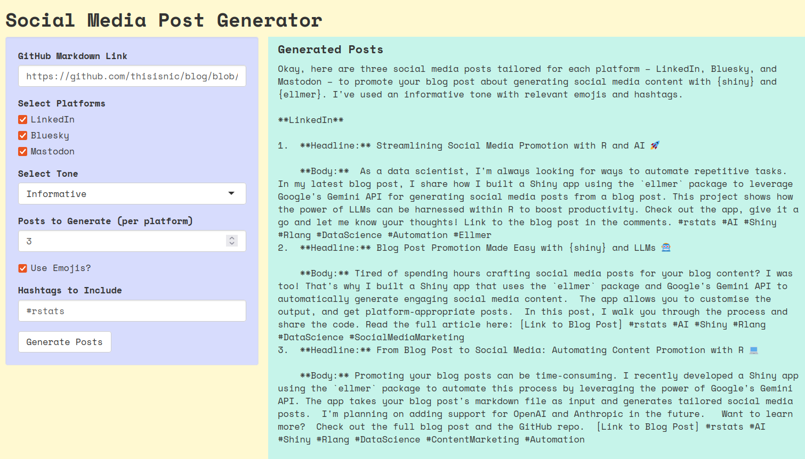

# Social Media Post Generator

This is a Shiny app that generates social media posts based on a GitHub Markdown link. Users can specify the tone, platforms, and additional settings to customize the generated content.



## Usage
1. **Run the app** in R using Shiny.
2. **Enter the GitHub Markdown file link.**
3. **Choose platforms** and adjust settings such as tone, emojis, and hashtags.
4. **Generate posts** and review the output.
5. Copy and use the generated content as needed.

## Requirements
- The `ellmer`, `shiny`, `httr`, `jsonlite`, and `glue` packages
- A **Gemini API key** (get one here: [Google Gemini API](https://ai.google.dev/gemini-api/docs/api-key))
- Save the API key as an environment variable: `GOOGLE_API_KEY`

## Installation

Install from GitHub:

```r
remotes::install_github("thisisnic/socialmediagen")
```

## Usage

Run the app:

```r
library(socialmediagen)
run_app()
```

## Notes

- The app retrieves raw Markdown content from GitHub, so ensure the provided link is correct.
- Adjusting tone and the number of generated posts may improve results.

